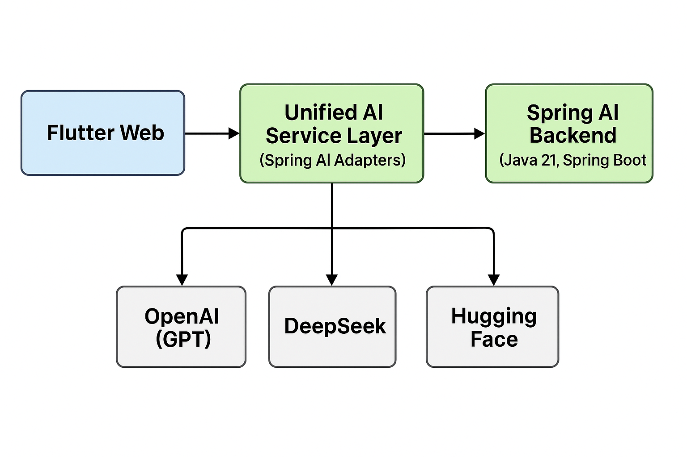
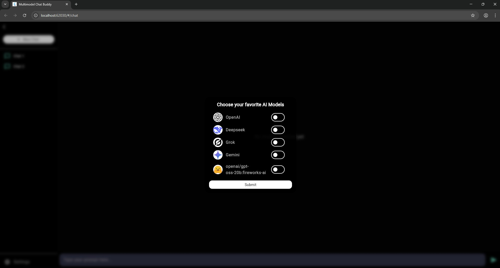

# multimodal-LLMs-hugging-face-integration

🌐 Multimodal LLMs Integration with Spring AI & Flutter

This project demonstrates end-to-end integration of multiple Large Language Models (LLMs) — including OpenAI (ChatGPT), DeepSeek, and Hugging Face models — into a unified AI-powered web application.
It showcases multimodal AI capabilities with a Spring AI backend and a Flutter-based frontend for seamless cross-platform user interaction.

🚀 Features

✅ Multi-LLM Support – Integrated ChatGPT (OpenAI), DeepSeek, and Hugging Face models into a unified service.

✅ Spring AI Powered Backend – Leveraged Spring AI for consistent API design, model abstraction, and easy extensibility.

✅ Cross-platform Frontend (Web) – Built with Flutter for a modern UI/UX.

✅ Plug-and-Play Model Architecture – Easily extendable for adding new models.

🏗️ Architecture Overview

🏗️ User Interface

⚙️ Tech Stack

Backend

✅ Java 21

✅ Spring Boot 3.x

✅ Spring AI (abstraction for multiple LLM providers)

✅ Maven for dependency management

✅ RESTful APIs for model interactions

✅ Hugging Face Inference API integration

Frontend

✅ Flutter (Web)

✅ Responsive Material Design UI

API integration for real-time LLM responses

🔑 Key Technical Highlights

✅ Spring AI Abstraction: Instead of directly binding to each model’s SDK/API, this project uses Spring AI’s abstraction layer to seamlessly switch between models like ChatGPT, DeepSeek, and Hugging Face.

✅ Multimodal AI: Hugging Face models were integrated for text generation

✅ Prompt Engineering: Structured prompts were applied across models to standardize outputs and improve consistency.

✅ Scalability & Extensibility: The backend is modular, allowing easy onboarding of new models by implementing simple adapters.

✅ Frontend UX: Flutter frontend provides chat-style interaction with LLMs, with clean and intuitive UI for model selection.

🧭 Future Enhancements

🔗 Integration with LangChain4J for advanced chaining.

📚 Adding RAG (Retrieval-Augmented Generation) with vector databases.

🎙️ Voice input/output support (speech-to-text + TTS).

🧑‍💻 More multimodal models (video, audio).

<h1>❤️ Support & Engagement ❤️</h1>

⭐ If you find this project helpful, please give it a star on [GitHub](https://github.com/zees007/microservices-jwt-authentication-authorization-spring-security)! 

⭐ If you find this article informative and beneficial, please consider showing your appreciation by giving it a clap 👏👏👏, highlight it and replying on my story story. Feel free to share this article with your peers. Your support and knowledge sharing within the developer community are highly valued.

⭐ Please share on social media

⭐ Follow me on : [Medium](https://medium.com/@mhmdzeeshan) || [LinkedIn](https://www.linkedin.com/in/zeeshan-adil-a94b3867/) || [X (Formerly Twitter)](https://x.com/DevZeesCraft)

⭐ Check out my work, projects, and more on my [Linktree](https://linktr.ee/zees007)

⭐ [Check out my other articles on Medium](https://medium.com/@mhmdzeeshan)

⭐ [Subscribe to my newsletter 📧](https://medium.com/@mhmdzeeshan/subscribe), so that you don’t miss out on my latest articles.

⭐ If you enjoyed my article, please consider [buying me a coffee ❤️](https://buymeacoffee.com/mhmdzeeshan) and stay tuned to more articles about java, technologies and AI. 🧑‍💻

👨‍💻 Author

 Zeeshan
🌍 Full-stack AI Developer | Java | Spring Boot | Flutter | Hugging Face | Generative AI
